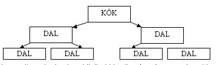
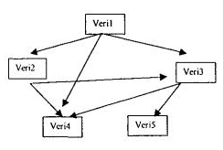
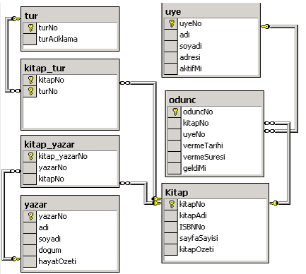
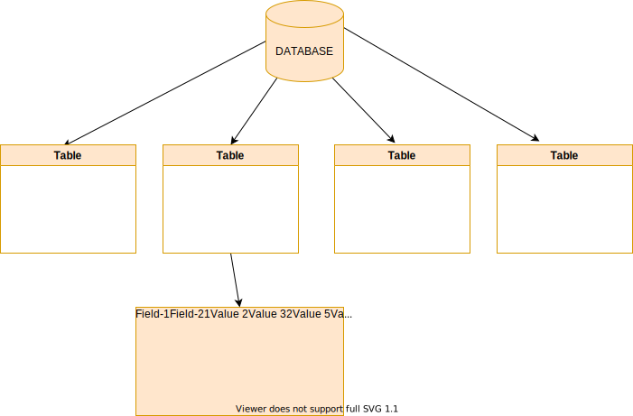

<!-- _backgroundColor: aquq -->

<!-- _color: orange -->

<!-- paginate: false -->

## CE208-Database Management Systems
### Week-1 (Intro)
#### Spring Semester, 2021-2022

**Instructor:**  Yıldıran Yılmaz
**Email:** yildiran.yilmaz@erdogan.edu.tr
**Office Hours:**  Thursday

Download [PDF-MS](1_veri_tabani_giris_week_1.pdf), [PDF-MD](week-1.en.md_slide.pdf), [PPTX-MD](week-1.en.md_slide.pptx), [PPTX-MS](1_veri_tabani_giris_week_1.pptx)


<iframe width=700, height=500 frameBorder=0 src="../1_veri_tabani_giris_week_1.pdf"></iframe>


<iframe width=700, height=500 frameBorder=0 src="../week-1.en.md_slide.html"></iframe>

---

<!-- paginate: true -->

### Outline

- What is Database?
- Database Examples
- Database
- What is Database Management System?
- Classification of Database Management Systems

---

### Outline

- Hierarchical databases
	- Network databases
	- Relational databases
	- Object Oriented databases
- Why use a database?
- Advantages of the Database Approach
- Database Management Systems

---

### Outline

- Database Structure
- Table
- Data Types
	- MYSQL Data Types
- Key
- Primary key
- Foreign key
- Database Design

---

## What is Database?

- It is an information repository where data that is related to each other is kept.

- The collection of data arranged in accordance with the purpose of use

- They are information stores with their logical and physical definitions.

---

## Database Examples

- University - Student Affairs Information System

- Hospital - Patient, doctor, treatment, equipment, financial information

- A commercial company - Customer, Product, Sales, Payment, Delivery information

- Bank - Customer, deposit, credit card, credit information

---

## Database

- The database concept was first introduced in the 1980s.

- It is used in everywhere from a simple web application up to large and complex data of international organizations

- Database applications are needed in many areas.

---

## What is Database Management System?

It is a software system in which various complex  following operations are performed.

- Creating a new database,
- Editing the database
- To use,
- Develop
- to take care of (maintanance)

---

## Classification of Database Management Systems

* By Data Model
  * Hierarchical
  * Network
  * relational
  * Object Oriented
* By Number of Users
  * single user
  * multi-user

---

### Hierarchical databases

- It is the first model used for databases.

- Hierarchical databases store information in a tree structure.



---

### Network databases

- When hierarchical databases were insufficient, a structure in which data was stored in the form of graphs, which is a more advanced version of trees, emerged at the end of the 1960s.



---

### Relational databases

- It was developed in the early 1970s.

- In this system, data is stored in tabular form.

- Connections between tables are represented by mathematical relationships.

- Almost all database programs today have this structure.

---

### Relational databases



---
 
### Object Oriented databases

- Objects used in many word processor and spreadsheet programs today are also used in databases.

- Object-oriented database means a database created and used in an object-oriented language such as 
  - `C++`, 
  - `C#`, 
  - `java`, 
  - `Visual Basic`.

---

## Why use a database?

- The traditional approach to holding, storing and accessing data uses the approach of grouping data into separate files.

- With the increase in data and the need to access and edit data at the same time, the traditional approach has been inadequate.

---

## Advantages of the Database Approach

- Preventing duplication of common data;

- Ensuring centralized control and consistency of data

- Ensuring data sharing

- Hiding physical structure and access method complexities from the user with multi-layered architectures,

- Presenting only the data that is of interest to each user in easy, understandable structures

---

## Advantages of the Database Approach

- Ease of application software development with the analysis, design and development tools provided.

- Providing the necessary facilities for data integrity,

- Ensuring the desired level of security and confidentiality

- Solving operational problems such as backup, reboot, repair

---

## Database Management Systems

- Oracle database

- IBM DB/2

- Adaptive Server Enterprise

- Informix

- <span style="color:#FF0000">Microsoft Access </span>

- <span style="color:#FF0000">Microsoft SQL Server </span>

- Microsoft Visual FoxPro

- <span style="color:#FF0000">MySQL</span>  <span style="color:#FF0000"> </span>

---

## Database Management Systems

- PostgreSQL

- Progress

- SQLite

- Teradata

- CSQL

- OpenLink Virtuoso

---

## Database Structure




---

## Table

- A database consists of data stored in tables.
- Tables are a group of data that is formed by arranging data in rows and columns.
- For example, 2 tables are created to store the course content and student information in the database:
  - Student information
  - contents

---

## Table

- Each piece of information in the table is called a  **record** , and the columns are called  **a field** .

- For example, in the student information table, following information is included.
  - Student number,
  - Name and surname,
  - date of birth,
  - Place of birth,
  - E mail address

---

## Table

| Ogr_no | Ad_soyad | d_tarih | d_yeri | e-mail  |
| :-: | :-: | :-: | :-: | :-: |
| 1 | Ayşe Öztürk | 01.11.1979 | Konya | ayse@gazi.edu.tr |
| 2 | Sema Özdemir | 24.05.1975 | Ankara | sema@gazi.edu.tr |
| 3 | Serdar  Gülpınar | 06.06.1983 | Adana | serdar@gazi.edu.tr |
| 4 | Mehmet Efe | 11.02.1978 | Niğde | mehmet@gazi.edu.tr |
| 5 | Zerrin Polat | 22.08.1980 | Antalya | zerrin@gazi.edu.tr |
| 6 | Ulviye  Kubalı | 12.12.1984 | İstanbul | ulviye@gazi.edu.tr |

---

## Table

**Fields**

| Ogr_no | Ad_soyad | d_tarih | d_yeri | e-mail  |
| :-: | :-: | :-: | :-: | :-: |

**Record**

|  |  |  |   |   |
| :-: | :-: | :-: | :-: | :-: |
| 1 | Ayşe Öztürk | 01.11.1979 | Konya | ayse@gazi.edu.tr |
| 2 | Sema Özdemir | 24.05.1975 | Ankara | sema@gazi.edu.tr |


---

## Data Types

- In order to have information about the structure of the records kept in the database, some properties of the fields must be defined beforehand.

- *For example*, the personnel registration number must be made up of integers, names and surnames must be words.

---

### MYSQL Data Types

- **Numeric**

- **Date and Time**

- **Textual (String)**

- **Spatial**

---

### MYSQL Data Types

#### TINYINT :

- For very small integer values
- When Signed is defined, the values are between `-128` and `127`.
- Unsigned defined range is between `0` and `255`.

---

### MYSQL Data Types

#### SMALLINT :
- For small integer values
- When Signed is defined, the values are between `-32768` and 32767.
- Unsigned defined range is `0` to `65535`.

---

### MYSQL Data Types

#### MEDIUMINT :

- For medium-sized integer values.

- When Signed is defined, the values are between `-8388608` and `8388607`.

- Unsigned defined range is between 0 and `16777215`.

---

### MYSQL Data Types

#### INT(n):Interger

- For normal-sized integer values.

- When Signed is defined, the values are between `-2147483648` and `2147483647`.

- Unsigned defined range is between `0` and `4294967295`.

---

### MYSQL Data Types

#### BIGINT :

- For large integer values.
- Can take integer value `-9223372036854775808` to `9223372036854775807`

---

### MYSQL Data Types

#### FLOAT :

- Keeps numbers with their fractions.

- Max. character width is taken as a parameter. (`up to 23 digits`)

---

### MYSQL Data Types

#### DOUBLE:

- Keeps numbers with their fractions.

- Max. character width is taken as a parameter. (`24 to 53 digits`)

---

### MYSQL Data Types

#### DECIMAL:

- Keeps numbers with their fractions.

- The integer part can have a maximum `64 digits`, and the fractional part a maximum `30 digits`.

---

### MYSQL Data Types

#### DATETIME:

- Datetime information in `Year+Month+Day+Hour+Minute+Second` format

``` SQL
YYYY-MM-DD HH:MM:SS
```

---

### MYSQL Data Types

#### TIMESTAMP:

- Time information from `January 1, 1970` to `January 18, 2038`, in the format `Year+Month+Day+Hour+Minute+Second`.

``` SQL
YYYYMMDDHHMMSS
```

---

### MYSQL Data Types

#### DATE:

- Date field that can change from `1000-01-01` to `9999-12-31`.

``` SQL
YYYY-MM-DD
``` 

---

### MYSQL Data Types

#### CHAR(n):

- Fixed-length data with n characters.

---

### MYSQL Data Types

#### TEXT:

- A text field that can hold up to `65535` characters.

---

### MYSQL Data Types

#### MEDIUMTEXT:

- Text field up to `16777215` characters

---

### MYSQL Data Types

#### VARCHAR(n):

- Characters of varying size, not exceeding n

---

### MYSQL Data Types

#### BOOL:

- A data type that takes the value `0` or `1`. or `True/ False`

---

## Key

- A key forces one or more fields to be entered as qualifiers for a row.
- There are 2 types of keys:
  - Primary Key
  - Foreign Key

---
 
##  Primary key

- It is the key data that will enable access to a record.

- For example, there are two Ahmet among the students. Each student must have a unique number in order to find the Ahmet we want while searching.

- For example student number could be a primary key

- Multiple fields can have primary keys together

---

## Foreign key

- A foreign key is a set of attributes in a table that refers to the primary key of another table. The foreign key links these two tables.

---

## Foreign key

**Persons Table**

| PersonID | LastName | FirstName | Age |
| :-: | :-: | :-: | :-: |
| 1 | Hansen | Ola | 30 |
| 2 | Svendson | Tove | 23 |
| 3 | Pettersen | Kari | 20 |

---

## Foreign key

**Orders Table**

| OrderID | OrderNumber | PersonID |
| :-: | :-: | :-: |
| 1 | 77895 | 3 |
| 2 | 44678 | 3 |
| 3 | 22456 | 2 |
| 4 | 24562 | 1 |

---

## Foreign key

- Notice that the "PersonID" column in the "Orders" table points to the "PersonID" column in the "Persons" table.

- The "PersonID" column in the "Persons" table is the **PRIMARY KEY** in the "Persons" table.

- The "PersonID" column in the "Orders" table is a **FOREIGN KEY** in the "Orders" table.

- The **FOREIGN KEY** constraint prevents invalid data from being inserted into the foreign key column, because it has to be one of he values contained in the parent table.


---

## Database Design

- Objects are defined

  - **Library system:** books, members, types, loan movements


---

## Designing a database

- A table is created for each object:
  - book,

  - members,

  - types,

  - woodc_movements

---

## Designing a database

- A key field is selected for each table

  - **book table:** *book no*

  - **Members table:** *Userno*

---

## Designing a database

- A column is added to the table for each property of the objects

  - **Book table:** book number, year, author, name, related field

---

## Designing a database

- Additional tables are created for recurring object properties.
  - **request table:**

| userno | request_date | Book_name | Book_date | Book_author | Related_field |
| :-: | :-: | :-: | :-: | :-: | :-: |
| . | . |  .| . |  .| . |
| . | . | . | . |.  |.  |


---

## Designing a database

- Fields that are not directly related to the table are determined.
  - The address of the member who borrowed the book in the loan transactions table is not directly related to this table.

  - This data should be included in the **members table** where member information is kept.

---

## Designing a database

- Relationships between tables should be defined.
  - The relationship between the **fields** in a **table** is defined.
  - For example, the **userno** field in the **members table** should be associated with the **userno** field in the **request table**.


---

## Resources

- Köseoğlu, K. (2005). Veri Tabanı Mantığı. Şefik Matbaası. İstanbul

- Alokoç Burma, Z. (2005). Veritabanı Yönetim Sistemleri ve SQL / PL - SQL / T – SQL. Seçkin Yayıncılık. Ankara

---

$End-Of-Week-1-Module$
