<!-- _backgroundColor: aquq -->

<!-- _color: orange -->

<!-- paginate: false -->

## CE208-Database Management Systems

### Week-2 (Database and Fundamental Concepts)

#### Spring Semester, 2021-2022

**Instructor:**  Yıldıran Yılmaz
**Email:** yildiran.yilmaz@erdogan.edu.tr
**Office Hours:**  Thursday

Download [PDF-MS](../files/week-2.pdf), [PDF-MD](week-2.tr.md_slide.pdf), [DOCX-MD](week-2.tr.md_word.docx), [PPTX-MD](week-2.tr.md_slide.pptx), [PPTX-MS](../files/week-2.pptx)

<iframe width=700, height=500 frameBorder=0 src="../files/week-2.pdf"></iframe>
<iframe width=700, height=500 frameBorder=0 src="../week-2.tr.md_slide.html"></iframe>
---

<!-- paginate: true -->

---

## Why we use the database?

* The purpose of the database;
  * helping people and organizations keep track of things.

---

## Why we use the database?

- Lists are used to keep track of things without using a database.
  - Shopping list,
  - to-do list,
  - List of paid invoices

---

## Why we use the database?

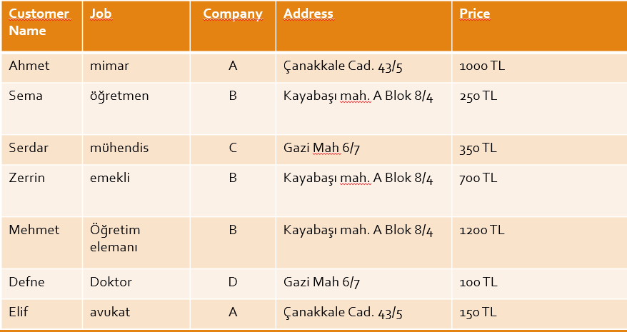

---

## Why we use the database?

- Problems with lists;
  - For example, the address of company B has changed.
  - Address information in 3 lines should also change
  - If it is missing, information inconsistency occurs.
  - It can cause both **a waste of time** and an **error**.

---

## Why we use the database?

- Problems with lists;
  - For example, company A no longer works with your company,
  - If you delete the record related to company A from the list, you will lose information such as customer information and company address where the product was sold.

---

## Why we use the database?

- Problems with shared data;
- For example, different departments of your company need to display company information;
  - Communication department: company, address
  - Marketing department: company, price
  - Customer service: customer name, job, company

---

## Why we use the database?

- Problems with shared data;
  - Sharing all of this information with all departments is inconvenient for different reasons.
  - Security
  - customer privacy
  - etc.

---

## Why we use the database?

- The biggest drawback for lists is that it combines different types of information into a table.

---

## Why we use the database?

- For DMS,  the process of placing different types of information in different tables is called **normalisation**.
- For the previous list;
  - customers
  - Worked companies
  - sales information

---

## Why we use the database?

- Customers

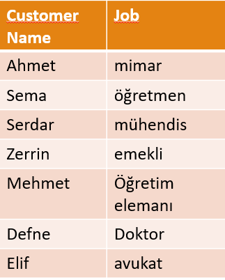

---

## Why we use the database?

- Worked Companies

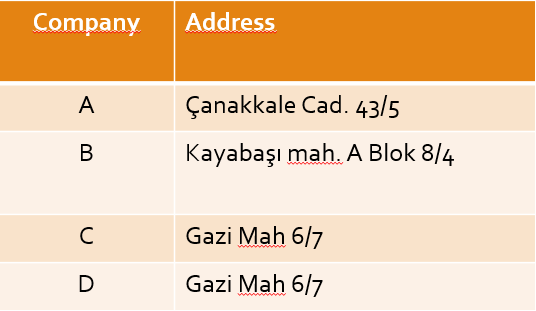

---

## Why we use the database?

- Sales Information

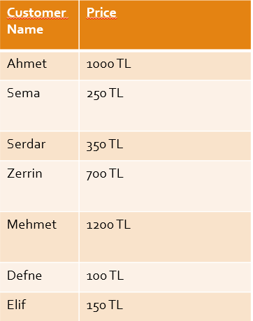

---

## Why we use the database?

- When different types of information are placed in different tables, most of the problems related to the following works are eliminated;
  - changing information
  - deleted information
  - with shared information.

---

## Why we use the database?

- When different types of data are in different tables;
  - Relationships need to be established in order to answer questions such as which customer bought the product from which company ?

---

## Why we use the database?

- Relations

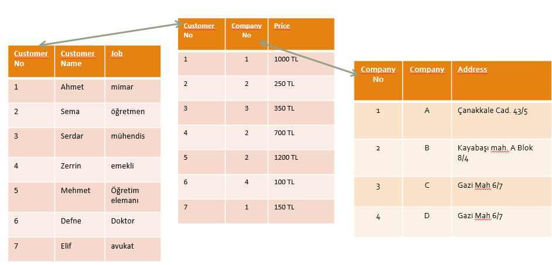

---

## Why we use the database?

- Relations

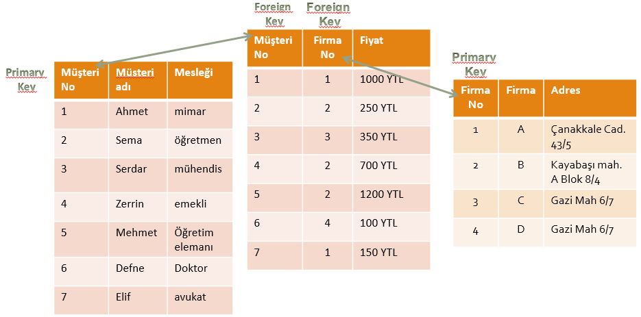

---

## Why we use the database?

- Joining tables
  - So what is done to get the initial holistic list?
  - SQL language is used.

---

## What is database management system?

- Components of the database system;

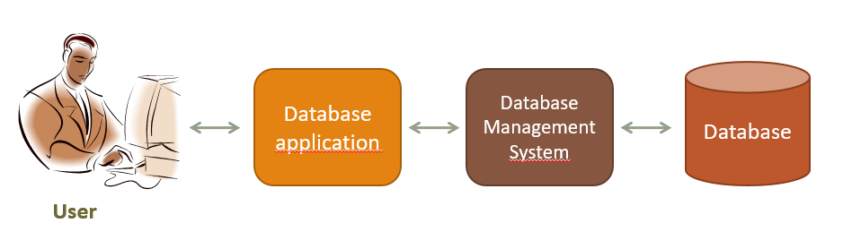

---

## What is database management system?

- The user does the following:
  - It uses the database to perform its work,
  - Adds new data
  - Modify existing data,
  - deletes data,
  - Reads data through queries or reports

---

## What is database management system?

* Database Application:
  
  * It is one or more computer programs that provide communication between the database management system and the user.
  * Creates queries and reports,
  * Receives data from the user or sends the data to the user,

---

## What is database management system?

* Database Management System:
  
  * It receives requests from the application and performs them by reading or writing data on database files,
  
  * It reads SQL statements and converts these statements into instructions for the computer's operating system to read or write data on database files.

---

## What is database management system?

* Functions of Database Application

* Functions of Database Management System

---

## What is database management system?

* Database Application:
  
  * Creates and processes forms,
  * Creates queries and forwards queries,
  * Creates and operates reports,
  * Performs application logic,
  * Controls the application.

---

## What is database management system?

* Database Application:

* Creates and processes forms, for example, in a web-based application;
  
  * Creates HTML and other web formats to be displayed on the user's computer,
  * When the user fills out the forms and sends the data back, it sends the DBMS requests for the necessary adjustments.
  * If an error occurs in the process, it displays the necessary message to the user and/or performs the necessary actions.

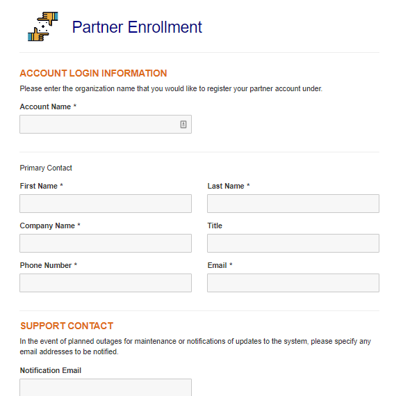

---

## What is database management system?

* Database Application:
* Creates queries and forwards queries,
  * Generates the query to be transmitted to DBMS,
  * These requests are usually expressed in SQL,
  * When the query is executed, the results are formatted and transmitted to the user,

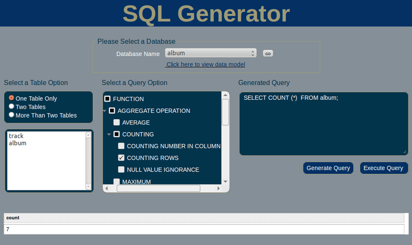

---

## What is database management system?

* Database Application:
* Creates and operates reports,
  * Data is requested from DBMS through queries and query results are presented in the form of reports,

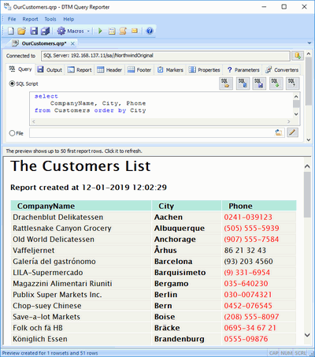

---

## What is database management system?

- Database Application:
- Performs application logic,
  - For example, the user made a request for 10 units, but 8 units were found in stock,
  - What happens depends on the logic of the program,
  - It is the task of the application program to implement the appropriate logic.

---

## What is database management system?

* Database Application:
  
  * Controls the application

---

## What is database management system?

* The Database Management System does the following:
  
  * Creating the database, creating the tables,
  * Reading data from the database and updating the data,
  * Realizing the limitations on data values,
  * It prevents one user's process from interfering with the other user's process.
  * Allowing users to take action within the limits of their authority,
  * Backing up data in the database.

---

## Database

* Database is data stores that consist of following related records.
  
  * Metadata (metadata)
  
  * index
  
  * stored procedure
  
  * trigger
  
  * data integrity (referential integrity)

---

## Database

- Data about the structure of the database is called metadata.  
  - Table names
  - column names
  - Properties of tables and columns etc.

---

## Database

* Metadata example:

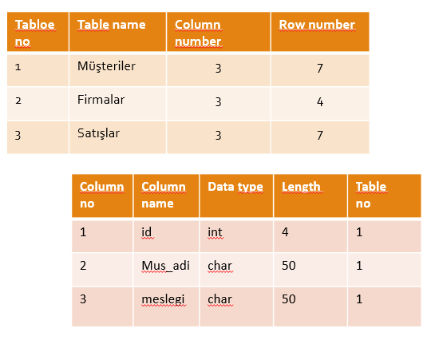

---

## Database

- Some databases contain application metadata.
- This metadata defines application components such as forms and reports.
- DBMS has several tools to show the structure of the database.

---

## Database

- At the same time, there are indexes used in databases to improve the performance of the database.
- Indexes are tools that show which records are in which tables.

---

## Database

- Stored procedures are compiled SQL statements.
- Because they are database objects, they are directly included in the database manager program.
- For example, stored procedures can be created for the purpose of taking a backup of data in a table or remove a backup of data that has passed more than a year.

---

## Database

- Stored procedures are codes for doing a specific duty defined in a database.

- These codes are optimized because they are compiled at the same time as they are written, and they are the fastest ready-to-run codes.

---

## Database

- A trigger is a special type of stored procedure that automatically runs when an event occurs in the database server.
- The events that trigger the triggers on the table are insert, update, delete events.

---

## Database

- For example, it is a typical use of triggers to decrease or increase the amount of stock as a result of stock movements.

---

## Database

- Since both **triggers** and **stored procedures** are codes on the database, they run on the database server.
- It is one of the powerful components of the Client & Server architecture.
- There are databases in client & server architecture as follows.
  - Oracle, Sybase, MS SQL, Interbase, FireBird etc.

---

## Database

- Because they work on the server where the data is located, the data does not go back and forth between the client and the server.
- Therefore minimal data is sent from the server to the client side.

---

## Database

- In a relational database
- Let's assume that the department information of the person in the **PERSONNEL** table is kept in the **SECTION_NO** variable and 
- the name of the department is in the **SECTION** table.

---

## Database

- If the section numbered as 1 is used by any personnel, the record with SECTION_NO value of 1 from the SECTION table must not be deleted.
- Protecting data integrity by making such controls is called **referential integrity**.

---

## Database

* The use of triggers is highly preferred in order to ensure data integrity.

---

## Database

* There can be 3 types of database systems:
  
  * used by a single person,
  * used by small businesses,
  * Used by large international companies

---

## Database

* used by a single person,
  
  * Painter
  * Whose house was painted, when and how much?
  * What was painted in the painting, what colors and styles were used?
  * Who referenced others? Who are the referrals?

---

## Database Systems

used by a single person,

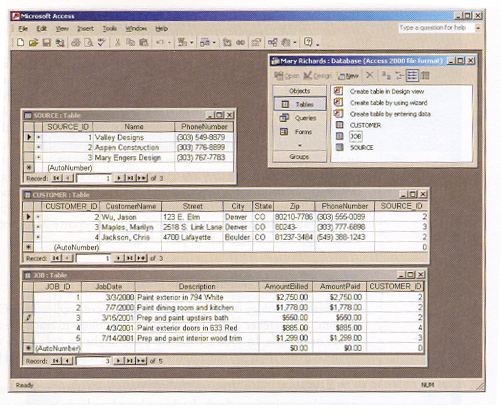

---

## Database Systems

used by a single person,

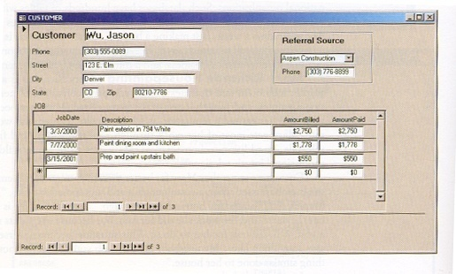

---

## Database Systems

used by a single person,

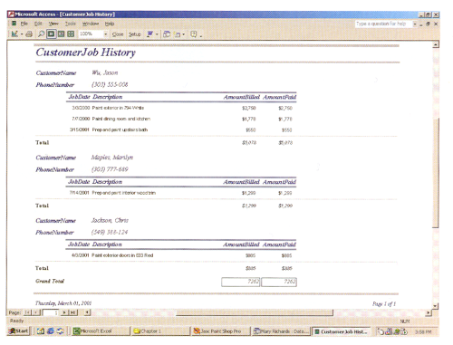

---

## Database Systems

- used by small businesses,
  * What are the rented musical instruments? How much is it rented?
  * Which musical instruments are rented the most?
  * Who made the lease? (multi-user database)
  * The same instrument cannot be selected by two different dealers at the same time!

---

## Database Systems

used by small businesses,

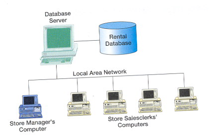

---

## Database Systems

used by small businesses,

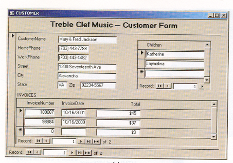

---

## Database Systems

used by small businesses,

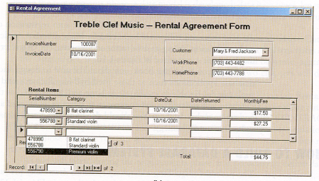

---

## Database Systems

used by small businesses,

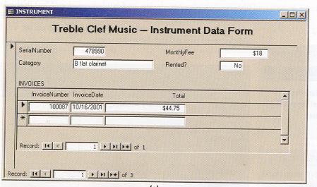

---

## Database Systems

- Used by large international companies,
  * Driver licensing and auto registration office
  * It has 52 different centers
  * Accidents of people, traffic violations are kept,
  * Is the license renewable, are there any limitations?
  * Database is used by 100s of people
    * Licensing and registration staff
    * Those who follow law enforcement
    * Finance department staff
  * Reachable 24 hours a day, 7 days a week

---

## Database Systems

Used by large international companies,

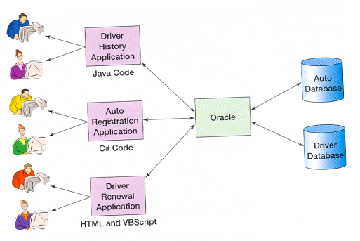

# References

- Kroenke, D. M. (2006).  __Database Processing:__  __Fundamentals, Design, and Implementation__ .Pearson Education International. Singapore,Canada,Japan.

- http://www.delphiturkiye.com/trigger.htm

---

$End-Of-Week-2-Module$
