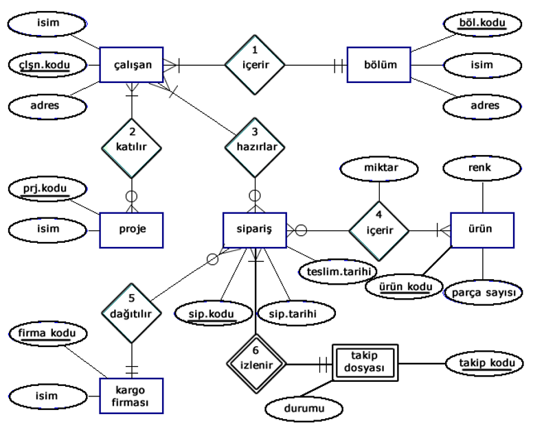
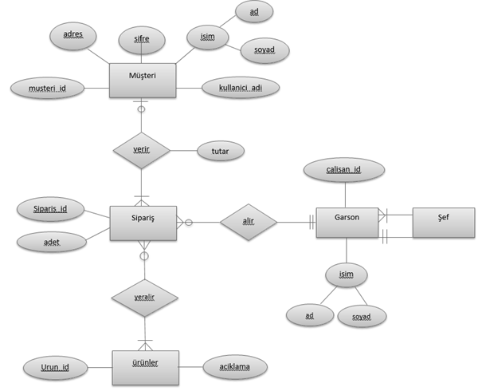

<!-- _backgroundColor: aquq -->

<!-- _color: orange -->

<!-- paginate: false -->

## CE208-Database Management Systems

### Week-4 (Case Study)

#### Spring Semester, 2021-2022

**Instructor:**  Yıldıran Yılmaz
**Email:** yildiran.yilmaz@erdogan.edu.tr
**Office Hours:**  Thursday

Download [PDF-MS](../files/week-4.pdf), [PDF-MD](week-4.en.md_slide.pdf), [DOCX-MD](week-4.en.md_word.docx), [PPTX-MD](week-4.en.md_slide.pptx), [PPTX-MS](../files/week-4.pptx)

<!-- <iframe width=700, height=500 frameBorder=0 src="../files/week-4.pdf"></iframe> -->
<iframe width=700, height=500 frameBorder=0 src="../week-4.en.md_slide.html"></iframe>

---

<!-- paginate: true -->

## **Case-Study-1**: Reading Entity Relationship (E-R) Diagrams

---

## Reading Entity Relationship (E-R) Diagrams

---

## Reading Entity Relationship (E-R) Diagrams

- An entity relation diagram given in the figure above can be read as follows:

---

## Reading Entity Relationship (E-R) Diagrams

- Exams are defined as an entity and each exam is identified by a code. Exams are also defined with date, name, duration, location and explanation attributes,

---

## Reading Entity Relationship (E-R) Diagrams

- Reads are defined as an entity, and code information (primary key) enables a read piece to be completed on its own in the system. Reading entity is identified by name, weight, fileName, and code attributes,

---

## Reading Entity Relationship (E-R) Diagrams

- There is a relation between exams and readings entities, called examReading. In addition, sequence information (index) should be kept showing the order in which an exam reading passage should be displayed in that exam. This information is defined by the index attribute added to the exam-readings relation. This relation is of M-N type and according to this relation:
  - (a) More than one reading of an exam can be defined,
  - (b) A reading passage can be used for more than one exam,
  - (c) At least one reading passage must be defined for an exam.

---

## **Case-Study-2:** Draw the entity-relationship diagrams corresponding to the requirements analysis given below

---

## Banking System

- A bank stores account information of its customers:
  
  - Each customer has customer number, name, surname, phone (work, home and mobile), address and customer type (individual or corporate) information.
  
  - Each account has account number, IBAN number, account opening date, account type (currency, TL), account status (active or passive) and balance amount information.
  
  - Every customer has at least one account. Each account must belong to a customer, either individually or institutionally. Any account can be opened for multiple customers as a joint account.

---

## Banking System

**Lets Build Model Together...**

---

## Airline System

- An airline company will use database automation:
  
  - Each aircraft in the company's fleet is registered with a code number. In addition, the brand, model, passenger capacity and range information of this aircraft are also stored. Not all aircraft are in active use, some may be under maintenance/repair.
  
  - Every flight has a number. The departure and arrival points of this flight are determined. In addition, the date and time of this flight and which aircraft will be operated are determined.

---

## Airline System

- An airline company will use database automation:
  
  - Each passenger is given a number by company to be used on all flights with that company. In addition, the name, surname, phone (work, home and mobile) and address of that passenger are also stored.
  
  - All flights operated by a passenger can be easily accessed by the relationship between flight and passenger information.

- There can be more than one passenger on a flight. There must be at least one passenger on a flight. A passenger must have taken at least one flight. A passenger may have joined more than one flight.

- An airplane can make more than one flight. An aircraft may not be used on some flights. There must be a plane belonging to a flight.

---

## Airline System

**Lets Build Model Together...**

---

## **Case-Study-3** : Reading E-R Diagram

---

## Reading E-R Diagram

Below is the entity-relationship diagram of the automation system of a multi-divisional company that produces various projects and sells over the internet.

---

## Reading E-R Diagram

- Please explain how many elements there are in all the relations in the diagram, and the participation constraints of all the relations, by specifying the relation number. 
  - (Example: "A doctor can care for more than one patient; every patient must be treated by a doctor.")

---

---

## Reading E-R Diagram

- In the entity relation diagram below;
  - Determine the degrees of relations
  - Express the entities, attributes and constraints based on the given entity relation diagram.

---

## Reading E-R Diagram

---

## Reference

- Tokdemir, G.  ve Çağıltay, N. E. (2010).  Veritabanı Sistemleri Dersi. Seçkin yayıncılık, Ankara.

---

$End-Of-Week-5-Module$
